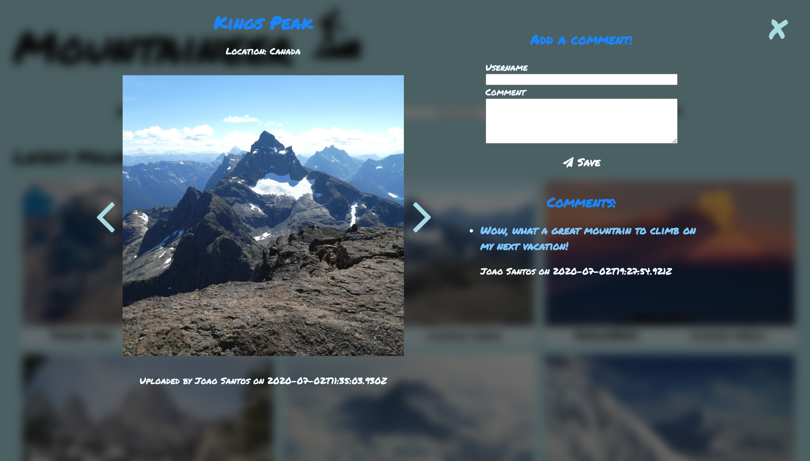

# Imageboard Demo

This is a Vue project developed while at my Full Stack Bootcamp at Spiced Academy, in the course of 4 days, hence the simplicity of it.

It features a simple 2 component structure where you can add new images and comments to each image. It has not been developed to be a full scale app with Authentication or functional Database but rather an exercise to practice the Vue concepts, therefore there's no possibility of testing this app unless you'd like to connect it to your own Postgres Database and AWS S3 bucket. 

This is the main page where you can add new images:

Once you scrolled down further images load and once there's no more images, a message shows up to inform the user of that fact:

After clicking an image a modal pops up and you can see any comments made and add one yourself if you want, as well as clicking on the arrows to navigate between images:

